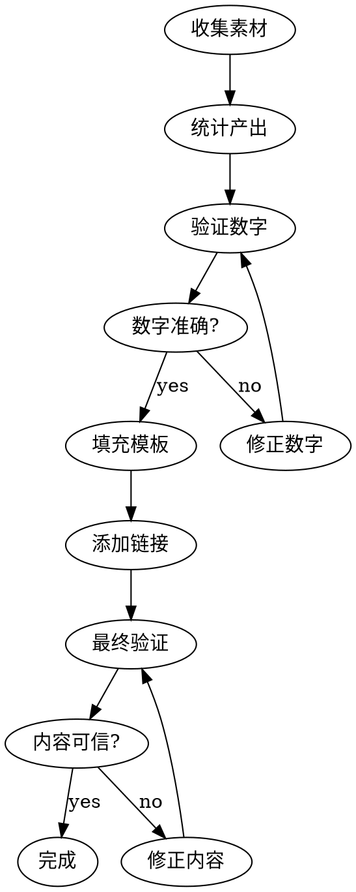

# AI Assisted Case Study Generator

将 AI 辅助研发过程沉淀为可信的案例文档。

## Core Principle

**所有数字必须可验证，所有示例必须来自真实对话。**

## When to Use

- 完成阶段性 AI 辅助任务后需要总结
- 向团队分享 AI 协作经验
- 撰写技术复盘或知识沉淀文档

## When NOT to Use

- 任务进行中（等完成后再总结）
- 没有可量化的产出物
- 纯粹的聊天对话（无实质产出）

## Workflow



## Quick Reference

| 步骤 | 命令/工具 | 用途 |
|------|-----------|------|
| 搜索历史 | `episodic-memory:search-conversations` agent | 收集真实 prompt 和对话 |
| 统计文档数 | `find <dir> -name "*.md" \| wc -l` | 验证文档数量 |
| 统计行数 | `wc -l <dir>/**/*.md \| tail -1` | 验证总行数 |
| 按目录统计 | `for dir in */; do find "$dir" -name "*.md" \| wc -l; done` | 分类统计 |
| 获取仓库链接 | `git remote -v && git branch --show-current` | 添加 GitHub 链接 |

## Template

```markdown
# [主题] 案例

## 背景及问题
**业务背景：** [技术背景]
**研发阶段：** [问题定位/技术设计/代码测试/知识沉淀等]
**遇到的问题：** [列表]

## 解决过程
### Prompt 设计策略
[真实 prompt 示例，从历史对话中提取]

### 过程中遇到的问题及解决方案
| 问题 | 解决方案 |
|------|----------|

### 是否沉淀 Skill
[附 GitHub 链接]

## 结果
### 产出物统计
| 类别 | 数量 | 说明 |
|------|------|------|
[必须用命令验证]

### 时间节省估算
| 任务 | 传统方式预期 | AI 辅助实际 | 节省 |
|------|-------------|-------------|------|
[标注为"估算"]

## 思考
[可复制的最佳实践]

---
*基于 [链接](URL) 整理*
```

## Verification Checklist

```
□ 文档数量 - find | wc -l
□ 代码行数 - wc -l | tail -1
□ 分类数量 - ls -d */
□ Prompt 示例 - 来自 episodic-memory 搜索
□ 技术声明 - grep 源码确认
□ Skill 描述 - 与实际 SKILL.md 对比
□ 链接有效 - git remote -v 确认
```

## Common Mistakes

| 错误 | 修正 |
|------|------|
| 编造 prompt 示例 | 必须从历史对话提取 |
| 夸大数字 | 用命令验证，宁可保守 |
| 精确百分比如 82.5% | 用 ~80% 表示估算 |
| 遗漏链接 | 添加 GitHub/文档目录链接 |
| 时间估算无标注 | 明确标注"估算"或"预期" |

## Red Flags

- 数字未经命令验证
- Prompt 示例凭记忆编写
- 声明 "N+ 个功能" 但未 grep 确认
- 时间节省声称精确到个位数
